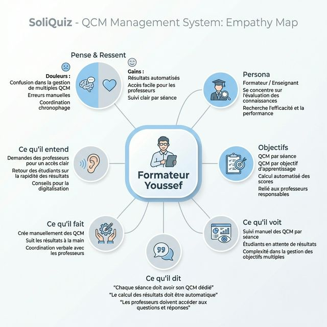
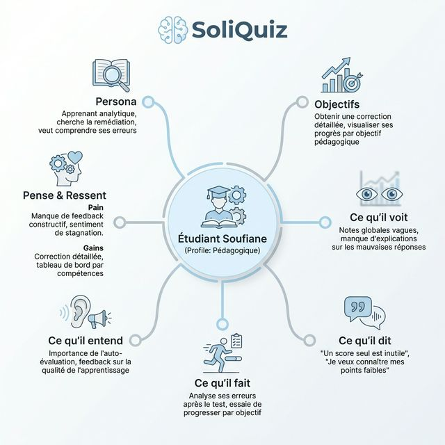
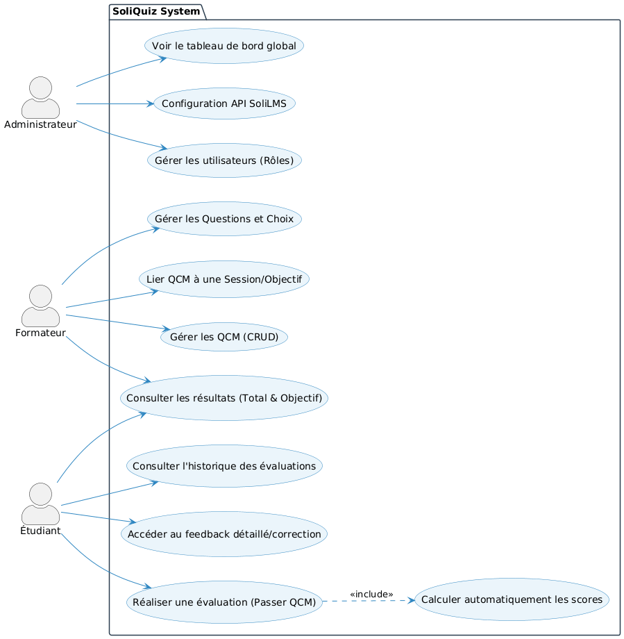

# Branche fonctionnelle

## Interviews d'empathie

### Synthèse des entretiens

Afin de cerner au mieux les attentes liées à la gestion des évaluations, nous avons mené des entretiens d'empathie avec les différents acteurs (formateurs, étudiants, administrateur). Voici les principaux constats et besoins qui en ressortent :

- **Les Formateurs (Youssef & Fatine)** : Ils subissent une perte de temps considérable liée à la double saisie des notes et d'un manque de centralisation (utilisation de Google Forms vs SoliLMS). Leurs besoins majeurs sont : la création simple de QCM personnalisés, une gestion par objectif pédagogique et une automatisation du calcul et de la remontée des notes.
- **Les Étudiants (Mehdi & Soufiane)** : Ils sont frustrés par l'ergonomie (illisible sur mobile) et l'absence de feedback immédiat sur leurs erreurs. Ils réclament une interface "mobile-first" rassurante (sauvegarde en temps réel), une gestion claire du temps, et surtout, l'affichage immédiat des corrections avec un suivi précis de leurs compétences par objectif.
- **L'Administrateur (Fouad)** : Il pointe du doigt la lourdeur administrative, la multiplication d'outils non officiels et le manque de transparence vers la direction. Ses besoins principaux incluent un tableau de bord global, une gestion unifiée des utilisateurs, et l'intégration totale des notes vers le système SoliLMS via API.

---

## Carte d’empathie
L’analyse de l’utilisateur nous a permis de comprendre que les apprenants de Solicode ont besoin d’un outil simple pour valider leurs connaissances sans stress, tandis que les formateurs ont besoin d'une autonomie totale sur la création des tests.







## Définition du problème

Le problème majeur identifié est la lourdeur de la **saisie manuelle des notes** dans SoliLMS après chaque évaluation quotidienne. Le fait de devoir saisir les notes manuellement en SoliLMS après l'évaluation constitue le point critique : cela prend un temps considérable aux formateurs, génère des erreurs de saisie et retarde le suivi pédagogique. De plus, le manque d'un outil centralisé et interactif pour l'auto-évaluation quotidienne au sein du bootcamp empêche un suivi précis lié aux micro-objectifs de formation.

### Problèmes secondaires

Actuellement, les QCM sont réalisés via Google Forms, ce qui ne répond plus aux besoins pédagogiques des formateurs. Après la phase d’empathie menée avec les formateurs, plusieurs limites ont été identifiées :

* **Absence de liaison structurée** entre les QCM, les sessions, les modules et les objectifs pédagogiques.
* **Difficulté à attribuer un QCM spécifique** à chaque session et à chaque objectif.
* **Manque de centralisation** : les professeurs ne disposent pas d’un espace unique pour gérer leurs QCM.
* **Absence d’un calcul automatique détaillé** des scores par objectif.
* **Difficulté de suivi clair** des résultats des étudiants, empêchant un feedback pédagogique immédiat.


## Sprints backlog
Le backlog a été organisé pour prioriser :
1. La connexion avec l'API de **SoliLMS** pour récupérer les données des apprenants et formateurs.
2. La gestion des quiz par objectifs pédagogiques.
3. L'automatisation de la remontée des scores vers SoliLMS pour éliminer la saisie manuelle.

## Diagramme de cas d’utilisation
Les diagrammes de cas d’utilisation de **SoliQuiz** illustrent les fonctionnalités clés du système, organisées par sprints lors du développement :

### Sprint 1 : MVP (Produit Minimum Viable)
Le premier diagramme illustre les fonctions principales permettant à l'apprenant de passer ses quiz quotidiens et au formateur de créer des QCM avec synchronisation SoliLMS.


### Sprint 2 : Fonctionnalités Avancées
Le diagramme suivant présente les fonctionnalités enrichies, y compris la gestion des objectifs pédagogiques et le suivi détaillé des performances.


### Couverture Globale
Le diagramme suivant présente la vue d'ensemble du système, illustrant toutes les interactions des acteurs avec l'application.




```{=openxml}
<w:p><w:r><w:br w:type="page"/></w:r></w:p>
```